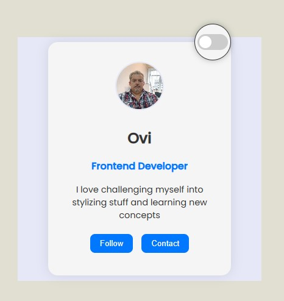
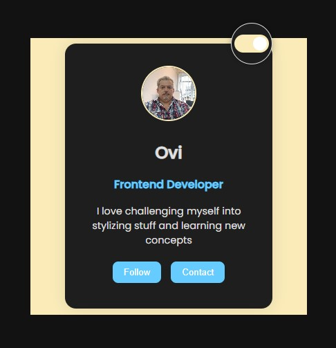

# 🌗 Profile Card with Dark Mode Toggle

    

## ✨Overview🙋‍♂️ 

A minimal, animated profile card built with HTML, CSS, and a bit of JavaScript.  
Features include:
- 🌙 Dark mode toggle via slider switch
- 🎯 Bounce animation on toggle
- 💡 Glow effect for visual feedback
- 💻 📱 Responsive layout (mobile-friendly)

## 📸 Preview

   

## 🚀 Setup

Clone the repo and open `index.html` in your browser or :
https://ovigota.github.io/ProfileCard/ 

## ℹ Technologies Used

- HTML5 for structure
- CSS3 for styling and animations
- JavaScript (vanilla) for theme toggle logic

## 🧠 Why I Built This 🧠

This mini project started as a simple challenge: build a single profile card that looks clean, feels interactive, and supports dark mode. I wanted to push beyond basic styling and explore how small UI details—like bounce animations and glow effects—can make a component feel alive.

The goal wasn’t to create a full webpage, but to craft a standalone, reusable card that could live anywhere: in a portfolio, a dashboard, or even as a design snippet. Of course, the toggle slider can be placed anywhere on a webpage 😎. I kept the JavaScript minimal, focusing instead on CSS transitions, keyframes, and custom properties to handle theme switching and animations.

This project helped me:
- Practice combining multiple animations without conflict
- Use CSS variables for theme control
- Build a toggle switch with smooth feedback
- Keep the layout responsive and accessible

It’s a small piece, but it reflects my approach to frontend: thoughtful, animated, and always learning by doing 👨‍🔧.

